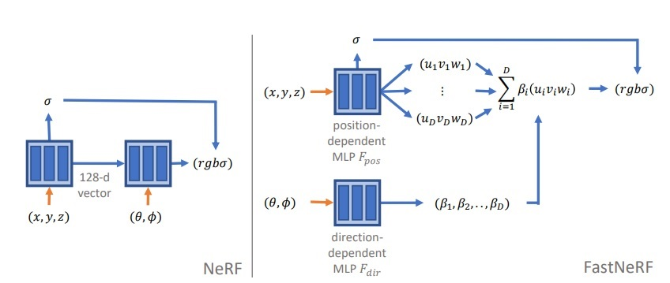

# FastNerf implementation

This implementation is based on the Paper [FastNeRF: High-Fidelity Neural Rendering at 200FPS](https://arxiv.org/abs/2103.10380)

## Introduction

Recent work on Neural Radiance Fields (NeRF) showed how neural networks can be used to encode complex 3D environments that can be rendered photorealistically from novel viewpoints. Rendering these images is very computationally demanding and recent improvements are still a long way from enabling interactive rates, even on high-end hardware. Motivated by scenarios on mobile and mixed reality devices, we propose FastNeRF, the first NeRF-based system capable of rendering high fidelity photorealistic images at 200Hz on a high-end consumer GPU. The core of our method is a graphics-inspired factorization that allows for (i) compactly caching a deep radiance map at each position in space, (ii) efficiently querying that map using ray directions to estimate the pixel values in the rendered image.




## Getting started

First of all, install the required dependencies using [conda](https://docs.conda.io/projects/conda/en/latest/user-guide/getting-started.html)

```
conda env create --file .\environment.yml
```

Activate the environment

```
conda activate fastnerf
```

### Training and test

Execute the following code to train and test the model

```
python main.py
```